---
author:
  name: "Nikita Gulyayev"
date: 2023-02-14
title: 'Clustering Hashcat for distributed cloud computing'
series:
- Tutorials
---

## Prerequisites

- [vast.ai account](https://vast.ai/) (with min 5$ balance)
- Linux web server with Internet access
- Cup of coffee

## Table of contents
1. Introduction
2. A word about Hashcat, hashing and passwords
3. Hashtopolis
4. [Tutorial] Hashtopolis server install
5. [Tutorial] Hashtopolis agent and runtime configuration
6. [Tutorial] Example task for MD5 hash cracking
7. Conclusion

## Introduction
As a hobbyist pentester, I often use Hashcat for password recoveries and hash-related tasks. However, I’ve noticed that Hashcat lacks certain features, such as notifications, a user interface for managing multiple hashing activities, storing cracked hashes, and parallel/distributed hash cracking across multiple GPU instances.

In this article, we’ll be discussing Hashtopolis, a product that I believe offers all the above features. Combining it together with Hashat cat help us to achieve maximum performance in distributed password cracking.

## A word about Hashcat, hashing and passwords


**Hashcat**, according to it’s developers, is the world’s fastest tool for password recoveries. It is available on Linux, macOS and Windows and can utilise both CPU and GPU.

With password-based authentication being one of the most popular ways to secure access to systems, it has become a critical task for security researchers and auditors to guess, intercept, or bypass passwords.

Password attack vectors can be categorized as **online** or **offline** attacks. In **online** attacks, multiple authentication attempts are made to guess a password, which can lead to account lockout. In **offline** attacks, hackers can acquire password hashes, and password recovery can be done entirely in the hacker’s environment, eliminating the need for access to the target system.

Most password and hash attacks fall into one of three categories:

* dictionary/wordlist attacks
* brute-force attacks
* hybrid attacks (combine dictionary attacks with a mask for brute-force attacks)

There may be situations like guessing passwords for archives, protected documents or private keys, but in general this is a password attack.

## Hashtopolis
https://github.com/hashtopolis/server

**Hashtopolis** is a multi-platform client-server tool for distributing hashcat tasks to multiple computers. The main goals for Hashtopolis’s development are portability, robustness, multi-user support, and multiple groups management. The application has two parts:

* Agent Python client, easily customizable to suit any need.
* Server several PHP/CSS files operating on two endpoints: an Admin GUI and an Agent Connection Point

Aiming for high usability even on restricted networks, Hashtopolis communicates over HTTP(S) using a human-readable, hashing-specific dialect of JSON.

Hashtopolis can manage multiple hashcat instances starting from v4.0.0 and higher. One of my favoutire features is “Generic crackers” — CLI interface for implementing custom vertions of hashcat. You can read more about “Generic crackers” [on the official doc page](https://github.com/hashtopolis/server/blob/master/doc/README.md).

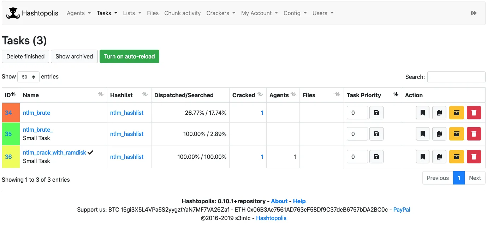

Hashtopolis features:
* Easy deployment of server and agents. Single entrypoint for all kinds of OS (Windows, macOS and Linux)
* User friendly web interface
* Dictionaries and rules management system
* Autoupdate feature for both Hashtopolis and Hashcat
* Hashes can be marked as “secret” and therefore distributed only to trusted agents
* Multiple import/export parameters
* Large metrics and statistics system
* Visual representation of hash chunk distribution
* Multi-user support and RBAC
* Multiple notifications parameters and Telegram-bot support

## Hashtopolis Server Install
Let’s try to spin up the server and explore Hashtopolis and it’s features. The minimum requirements for the server hardware are:

* 1 CPU
* 1 Gb RAM
* 10 Gb Storage space

For this example I’m going to choose installation inside Docker container as it’s the easiest and fastest way to get the server running. Hashtopolis developers provided Dockerfile and docker-compose.yml in their git repo.

You can find more detailed setup instructions [in the official docs](https://github.com/hashtopolis/server/wiki/Installation).

Let’s clone the repo first.
```bash
$ git clone https://github.com/hashtopolis/server && cd server
```

Here we will use the default provided `env.example` as our database will not be accessible from outside world.
```bash
$ cp env.example .env
```
Everything is prepeared and we are ready to start the server.
```bash
$ docker-compose up -d
Creating network "server_default" with the default driver
Creating db ... done
Creating hashtopolis ... done
```
Once docker-compose is up and running, we can access the web UI via *https://<your_hashtopolis_domain>:8080*

## Web Server Installation
Once you first open webpage, you will be prompted to start the Installation process. The whole process is simple and straightforwad.

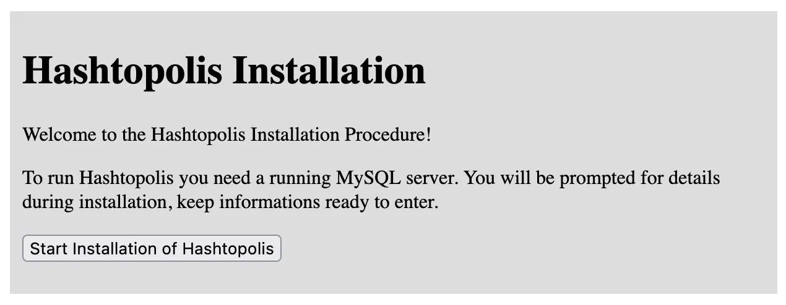

Provide Database connection parameters and click Continue. You can find these params in .env file we created earlier. Server hostname field should be equal to docker container name where MySQL process is running.

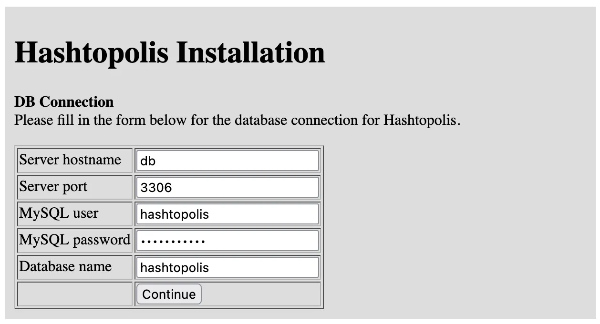

The next page will prompt you to create admin user credentials. Don’t forget to remember these!

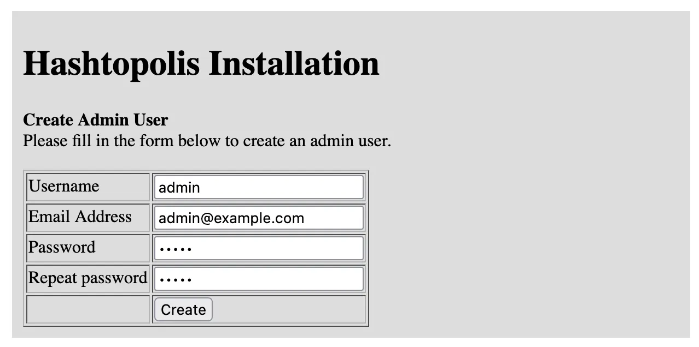

Once everything is complete, you will see the following page. Your **/install** directory should not be accessible by web UI by this stage. If you encounter any sort of issues I encourage you to see the logs of docker container and troubleshoot with [official FAQ](https://github.com/hashtopolis/server/wiki/Frequent-Problems).

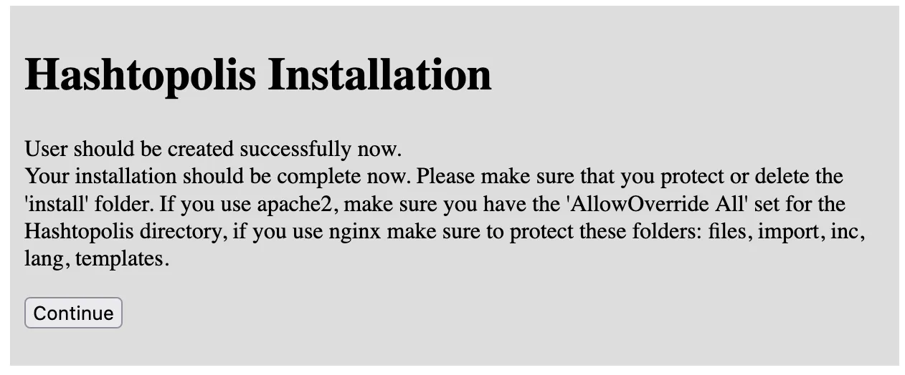

Now you are ready to enter admin credentials you created earlier and access Hashtopolis server main page.

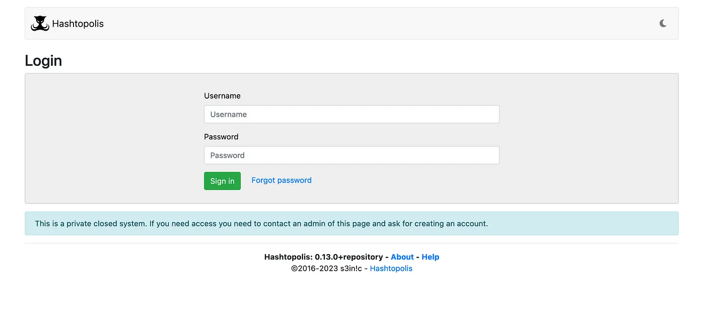

## Web Server Configuration
Before we start using the server, we have to make a few adjustments to the default configuration.

Hashtopolis agents are connecting via HTTP(S) and registering inside our Hastopolis server via **voucher code**. We can make these vouches reusable in order to use the same code for multiple agents.

Navigate to **Config -> Server** from the menu.

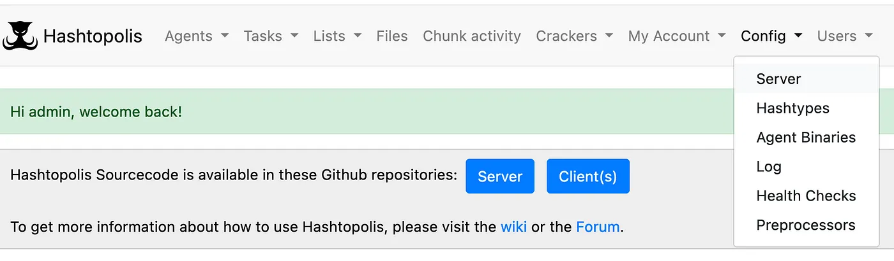

In the Server configuration, tick the box in front of *“Vouchers can be used multiple times and will not be deleted automatically”* and click **Save Changes**.

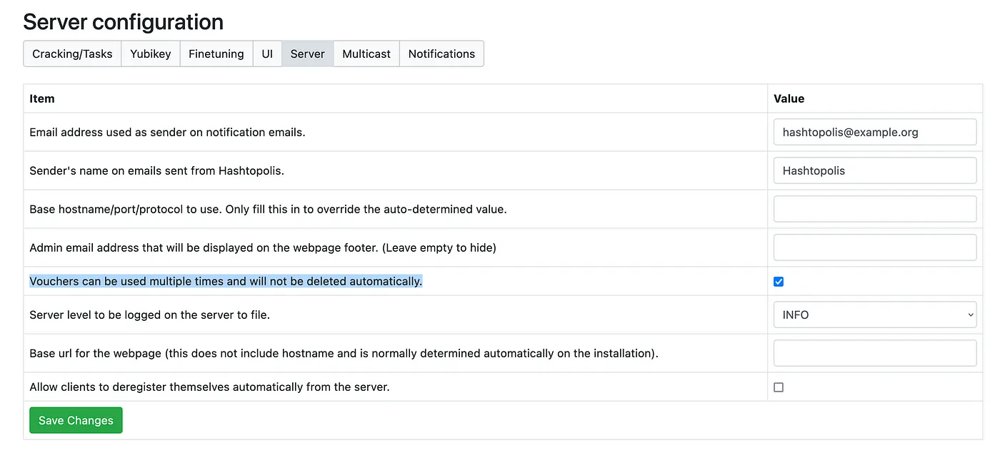

Next, navigate to **Agents -> New Agent** on the main menu and click **Create** button to add new voucher.

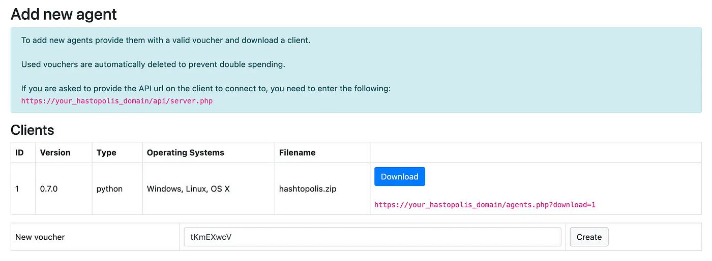

Notice how new voucher was registered. Save the voucher code as well as **API url** (from “Add new agent” section), we will need both of them later on during agent configuration.

## Hashtopolis agent and runtime configuration
In this tutorial we are going to use GPU instances provided by **vast.ai** — low-cost GPU rental. You should be just fine with a balance of 5$. We will run a **custom Python agent** on these instances.

### Python Agent
We are going to pack [agent-python from Hashtopolis repo](https://github.com/hashtopolis/agent-python) inside Docker image for easier deliver to GPU VMs.

Here is the Dockerfile for our python agent:
```Dockerfile
FROM nvidia/cuda:11.8.0-runtime-ubuntu22.04

RUN apt update && apt install -y --no-install-recommends \
  zip \
  git \
  python3 \
  python3-psutil \
  python3-requests \
  pciutils \
  curl && \
  rm -rf /var/lib/apt/lists/*

WORKDIR /root/agent-python

RUN git clone https://github.com/hashtopolis/agent-python.git && \
  cd agent-python && \
  ./build.sh && \
  mv hashtopolis.zip ../ && \
  cd ../ && rm -R agent-python$ docker pull 
```

### VAST.AI
As I mentioned before, we are going to use GPU instances provided by truly low-cost **vast.ai** platform.


Once registered, navigate to **“Create”** page and proceed to Instance Configuration by clicking **“EDIT IMAGE & CONFIG…”**.

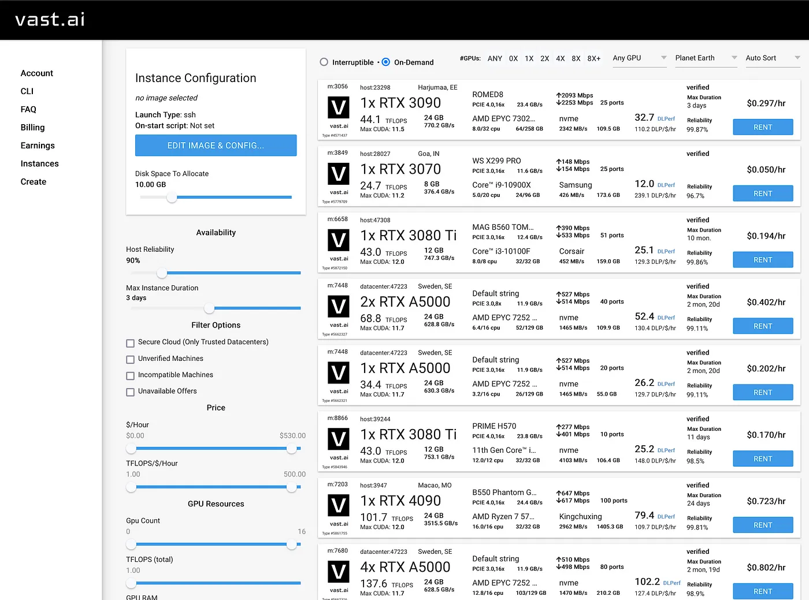

Specify our docker image name and tag. We can use prebuild docker image:
`nickyf0str/hashtopolis-agent-python:latest`

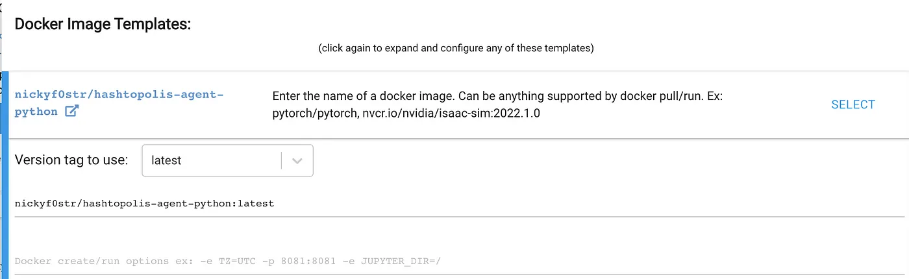

Make sure launch mode is set to **“Run interactive shell server, SSH”**.

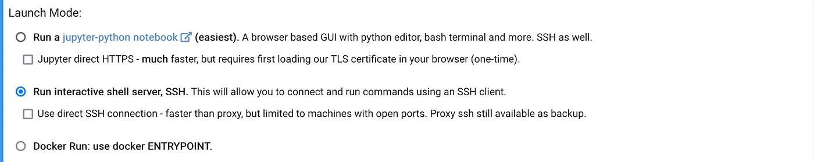

Specify On-start script. Remember we created voucher code and wrote down our Hashtopolis server API url? Here we are going to use them. Insert the script below into **“On-start script”** field and click **SELECT & SAVE**.

```bash
cd agent-python
python3 hashtopolis.zip --url server_api --voucher voucher_id
```

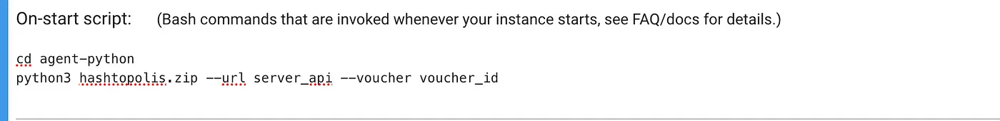

Now we are ready to launch some instances and observe how they automatically connect to our Hashtopolis server. Choose any instance of your choice (**make sure Max CUDA version is ≥11.5**) and click **“RENT”** button. The instance should automatically provision.

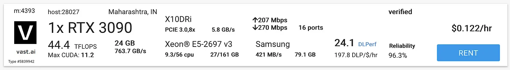

Sometimes instances can stuck in “LAUNCHING” state. My recommendation here is to delete that instance and rent another. Most of GPU hardware instances should work fine with our setup.

After VM is provisioned, we should see it on our Hashtopolis server in **Agents -> Show Agent** from the main menu.

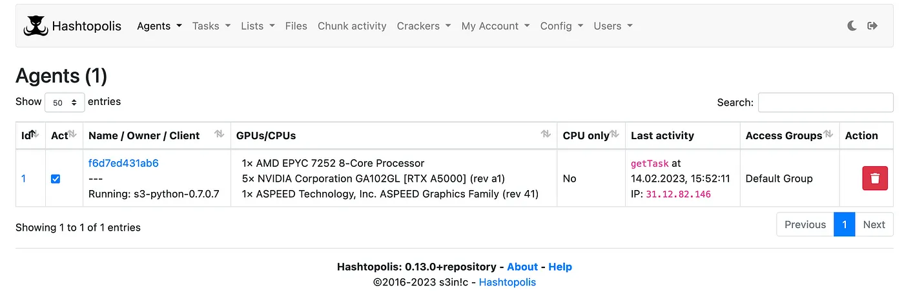

There are a few more things to configure inside our newly connected agent. Click on agent name, then after expanding additional fields via **“Show/Hide details”** update the following:

* Scroll down to **“Trust”** and **check the box** to permit our agent working with secret data.
* Select **“Keep agent running, but save errors”** from combo box on the right from **“Cracker errors”**. This will help our agent to continue running despite minor CUDA errors.

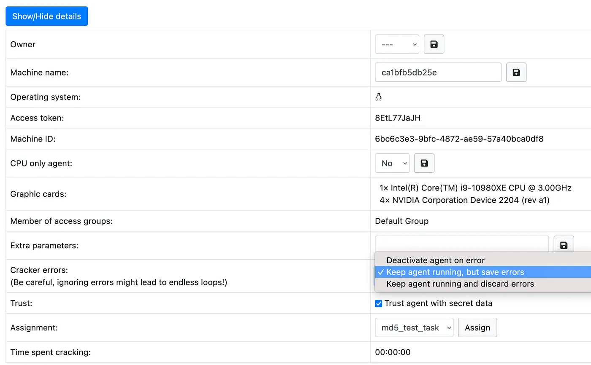

Next, we are going to create a test task and try to crack some hashes!

## Example task for MD5 hash cracking
We have successfully configured agent and now ready to to compute some hashed. To begin with, we need to create a **“Hast list”** to use it as a source of data in out task. Choose **Lists -> New hashlist** from the main menu.

For the sake of simplicity let’s try to crack one of the easies hashes on the planet Earth — **MD5**.

I’ve hashed **a very secret information** inside these 5 MD5 hashes.
```
639bae9ac6b3e1a84cebb7b403297b79
4015e9ce43edfb0668ddaa973ebc7e87
0cc175b9c0f1b6a831c399e269772661
d6a6bc0db10694a2d90e3a69648f3a03
97bc592b27a9ada2d9a4bb418ed0ebed
```

While choosing for hashtype, you can observe how large the list of available types. When we finish, I encourage you to try cracking some more difficult hashes. Who knows, maybe you will be lucky enought to compute a hash for one of those lost **Bitcoin wallet.dat** files.

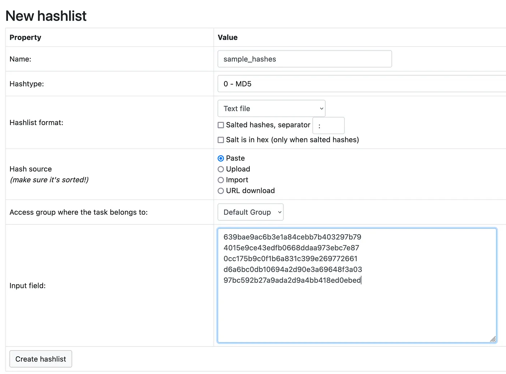

Fill the form according to the example above and let’s see if we can crack the secret data. When you done, click **“Create hashlist”**. Important thing — all the cracked/non-cracked hashes will be displayed in the created list, including all the other data and tasks related to this list. So **be careful** when deleting **hashlist**.

Next step, we are going to add a dictionary, since we are going to use a dictionary attack in this example (“-a0” argument from hashcat binary).

Open **Files** page from the main menu and select **Wordlists** tab.

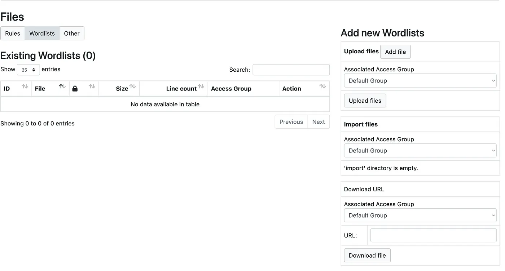

Let’s use a built-in function for downloading a dictionary file from URL.
We are going to use a very famous dictionary called **rockyou.txt** https://github.com/brannondorsey/naive-hashcat/releases/download/data/rockyou.txt

Paste the above URL in **Download URL** and click **“Download file”**. This will download dictionary and make it available for later usage.

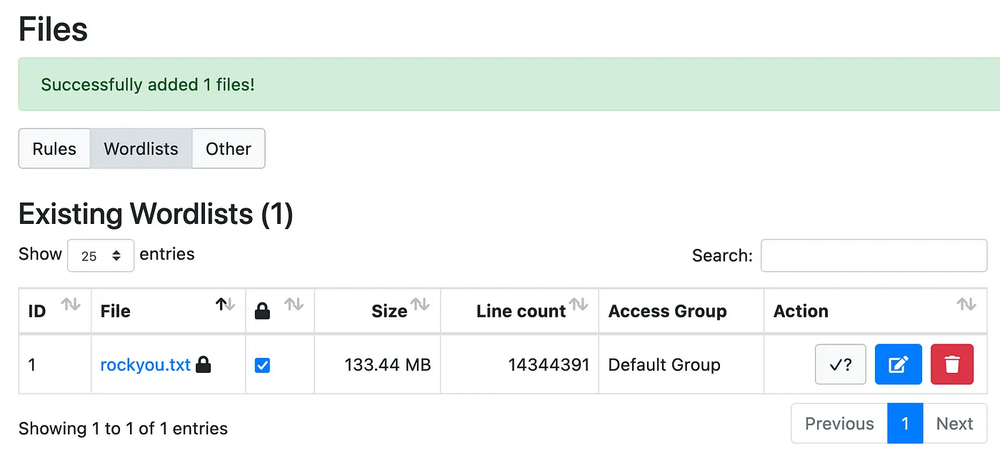

Now we can configure the task for agent. From the main menu choose **Tasks -> New task**. Fill out the form:

* Task name
* Hashlist
* Check the box **“Task”** on the right side of the page right near our wordlist.
* Append hashcat argument “-a0” insode **Command line** field to specify attack type

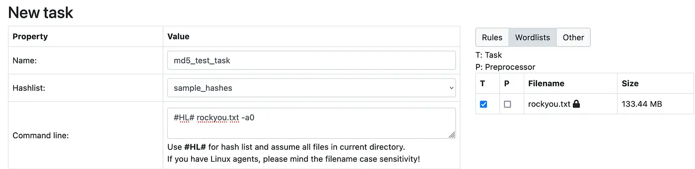

Leave all the rest parameter to default value. Click **“Create task”** at the bottom of the page.

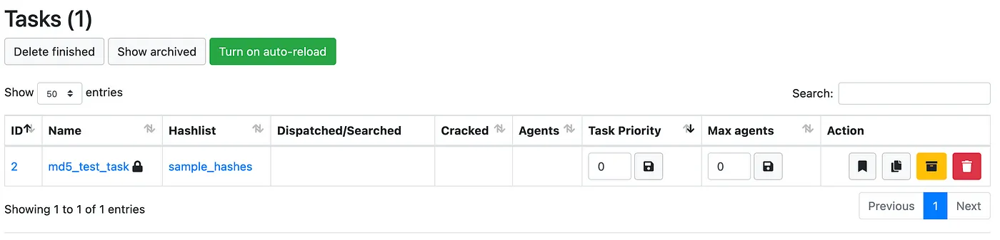

As you can see, our task “md5_test_task” does not havy any Agents assigned. We can fix this by clicking on the task name, scrollind down to **Assigned agents** and clicking **“Assign”** button right next to the agent id.

As soon as we assign agent to our task, the following instructions will be perfomed:
h
* Download **cracker binaries** and **wordlist** file to the agent
* Perform quick benchmark test
* Begin hash cracking procedure

During the cracking process we observe the console and monitor such parameters as system performanse (H/s), GPU preparations steps etc.

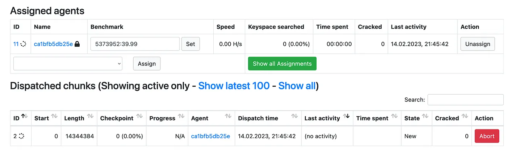

Since this is a super easy and small hashlist to crack, our task should be finished in a matter of seconds.

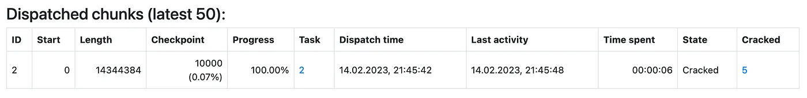

Let’s go and see the result! Navigate to **Lists -> Hashlists -> hashlist_name** and click the number on the right from *“Cracked:”* field.

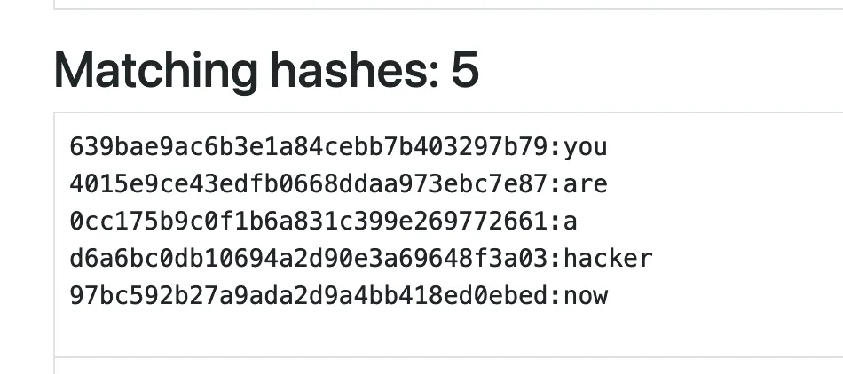

## Conclusion

In this tutorial we learned how to setup and configure Hashtopolis server, create python agent with Docker and use low-cost resources from vast.ai to deploy agents. This was just a small example to show you the potention of such a setup.

I encourage you to learn and practice with anything you are interested in, and in one way or another, you will explore the world around yourself and expand your knowledge.

### Useful links

Hashtopolis Official Git repo — https://github.com/hashtopolis/server

Hashtopolis forum — https://hashtopolis.org/

Hashtopolis Wiki — https://github.com/hashtopolis/server/wiki

Hashcat homepage — https://hashcat.net/hashcat/
