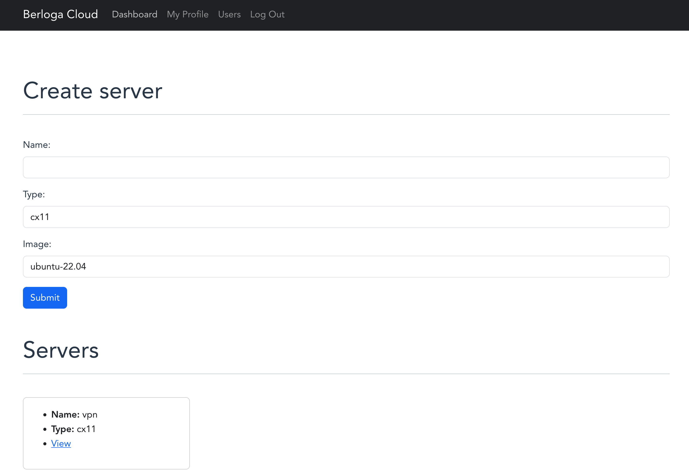
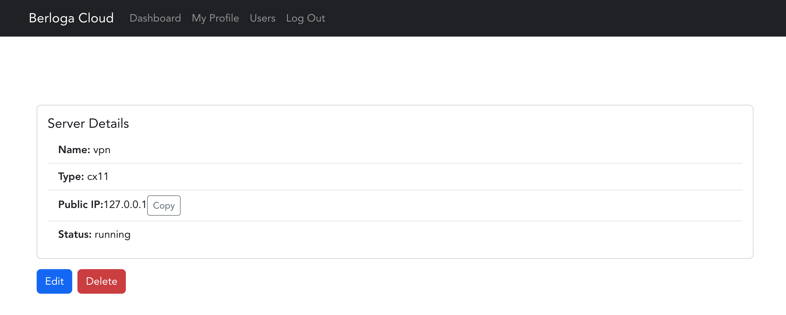

+++
title = "Berloga Cloud - Personal Private Cloud"
date = "2023-10-10"
aliases = ["projects"]
[ author ]
  name = "Nikita Gulyayev"
+++

## Overview
Berloga Cloud is my personal private cloud project, envisioned as a self-hosted alternative to major cloud platforms like AWS/Azure/GCP. It's designed to cater to personal or small-scale enterprise needs, providing cloud environment that prioritizes privacy, control, and customization.

## Features
- **Affordable Cloud Environment**: Existing configuration leverages Hetzner Cloud, which offers a wide range of affordable cloud servers.
- **Customizable Infrastructure**: Designed to be modular and adaptable to various use cases, whether it's web hosting, data storage, or application development.
- **Scalability**: Though initially designed for personal use, the architecture allows for scaling up to accommodate growing needs.
- **Cost-Effective**: Eliminates the recurring costs associated with commercial cloud services, making it an economical choice for personal or small business use.

## Why Berloga Cloud?
This project was born out of two desires:
1. Understand and implement cloud infrastructure technologies while maintaining complete control over my data.
2. Learn frontend development.

## Future Goals
- **Automate server configuration**: Design and implement a configuration management system to automate server setup: VPN-server, K8s-node and so on.
- **User-Friendly Interface**: Developing an intuitive UI to simplify management tasks.

## Repository
To explore the code visit the [Berloga Cloud GitHub repository](https://github.com/nickyfoster/berloga-cloud).