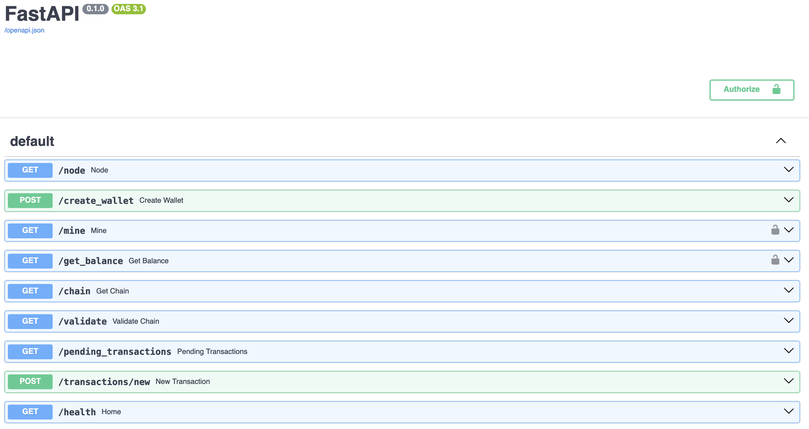

+++
title = "Pychain - Blockchain API written Python and FastAPI"
date = "2020-01-30"
aliases = ["projects"]
[ author ]
  name = "Nikita Gulyayev"
+++

## Introduction
Pychain is a streamlined Blockchain API, implemented in Python and using FastAPI. It serves as an intuitive and simple introduction to blockchain technology, ideal for educational purposes and hands-on learning. This project showcases how blockchain technology can be practically applied using Python.

## Key Features
- **Redis as State Storage**: Pychain leverages Redis, a robust in-memory database, for managing blockchain state. This choice ensures efficient data handling and storage.
- **FastAPI Framework**: Utilizing FastAPI, Pychain provides a high-performance, easy-to-use interface for blockchain interactions. The API enables operations like adding transactions, mining blocks, and inspecting the chain.

## Explore Pychain
Discover how Pychain works and experiment with your own blockchain. The FastAPI Swagger UI allows for easy exploration of all available endpoints, offering a hands-on experience with the blockchain technology.

## Repository
To explore the code visit the [Pychain GitHub Repository](https://github.com/nickyfoster/pychain).
